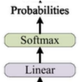
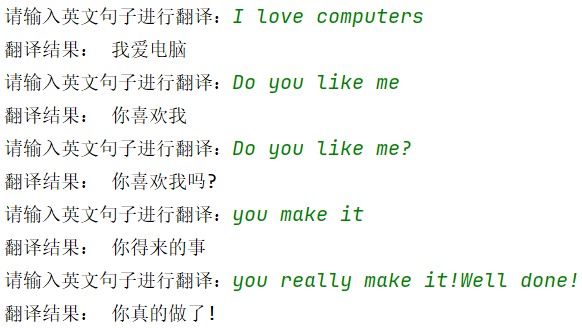

# 基于Transformer的机器翻译
原理部分的笔记请移步：https://github.com/hide-self/myTransformer_learning


## 数据集文件说明


整体的数据集文件放在了`./data`下。


**1.corpus.ch、corpus.en**

数据集原文说明：

corpus.ch、corpus.en两个文件就是翻译前后的完整原文，一句话一行，两个文件每一行一一对应

数据集下载方式：

可以通过这个网址下载类似的数据集：https://www.statmt.org/wmt18/translation-task.html

往下翻到一个表格，我们找到支持 **zh-en** 的数据集，把网址复制出去下载


下载之后进行解压，我们就可以找到对应的文件，`.en`、 `.zh`结尾的文件是可以用记事本打开的文本文件，他们就是英文、中文的翻译原文。


下载后最好改名，方便后续脚本操作


**2.analyze_corpus.py**

脚本作用：用于检测两个翻译原文文件，是否存在，是否行数匹配

脚本源码：

```python
import os


def analyze_corpus(ch_path, en_path):
    """
    分析双语语料库文件的详细信息
    Args:
        ch_path: 中文文件路径
        en_path: 英文文件路径
    """
    # 检查文件是否存在
    if not os.path.exists(ch_path):
        print(f"中文文件不存在: {ch_path}")
        return
    if not os.path.exists(en_path):
        print(f"英文文件不存在: {en_path}")
        return

    # 获取文件大小
    ch_size = os.path.getsize(ch_path)
    en_size = os.path.getsize(en_path)

    # 读取文件内容并统计行数
    with open(ch_path, 'r', encoding='utf-8') as f:
        ch_lines = f.readlines()
    with open(en_path, 'r', encoding='utf-8') as f:
        en_lines = f.readlines()

    # 计算字符数（不包括换行符）
    ch_chars = sum(len(line.strip()) for line in ch_lines)
    en_chars = sum(len(line.strip()) for line in en_lines)

    # 打印统计信息
    print("=" * 50)
    print("语料库统计信息")
    print("=" * 50)
    print(f"\n中文文件 ({ch_path}):")
    print(f"  文件大小: {ch_size / 1024 / 1024:.2f} MB")
    print(f"  总行数: {len(ch_lines):,}")
    print(f"  总字符数: {ch_chars:,}")
    print(f"  平均每行字符数: {ch_chars / len(ch_lines):.1f}")

    print(f"\n英文文件 ({en_path}):")
    print(f"  文件大小: {en_size / 1024 / 1024:.2f} MB")
    print(f"  总行数: {len(en_lines):,}")
    print(f"  总字符数: {en_chars:,}")
    print(f"  平均每行字符数: {en_chars / len(en_lines):.1f}")

    # 验证中英文行数是否匹配
    if len(ch_lines) == len(en_lines):
        print("\n✓ 中英文文件行数匹配")
    else:
        print("\n✗ 警告：中英文文件行数不匹配！")

    print("=" * 50)


if __name__ == "__main__":
    ch_path = 'corpus.ch'
    en_path = 'corpus.en'
    analyze_corpus(ch_path, en_path)

```


输出效果：


**3.get_train_dev_test.py**

脚本作用：将corpus.ch、corpus.en原文每行一一对应地放入json文件中，并划分出训练集`train.json`、开发集`dev.json`、验证集`test.json`

脚本原文：

```python
import json
import random

def split_corpus(zh_file, en_file, train_ratio=0.8, dev_ratio=0.1, test_ratio=0.1, shuffle=True, seed=42):
    """
    将对齐的中英文语料文件分割成 train/dev/test 并保存为 JSON 格式。

    参数:
        zh_file: 中文文件路径，每行一个句子
        en_file: 英文文件路径，每行一个句子
        train_ratio: 训练集比例
        dev_ratio: 开发集比例
        test_ratio: 测试集比例（需满足三者之和为1）
        shuffle: 是否随机打乱数据
        seed: 随机种子，用于复现
    """
    # 检查比例之和是否为1
    assert abs(train_ratio + dev_ratio + test_ratio - 1.0) < 1e-9, "比例之和必须为1"

    # 读取中文和英文文件，去除行尾换行符
    with open(zh_file, 'r', encoding='utf-8') as f:
        zh_lines = [line.strip() for line in f]
    with open(en_file, 'r', encoding='utf-8') as f:
        en_lines = [line.strip() for line in f]

    # 检查行数是否一致
    assert len(zh_lines) == len(en_lines), f"中英文文件行数不一致：{len(zh_lines)} vs {len(en_lines)}"

    # 组成句对列表
    pairs = [[en, zh] for en, zh in zip(en_lines, zh_lines)]

    # 随机打乱
    if shuffle:
        random.seed(seed)
        random.shuffle(pairs)

    # 计算分割点
    total = len(pairs)
    train_end = int(total * train_ratio)
    dev_end = train_end + int(total * dev_ratio)

    train_pairs = pairs[:train_end]
    dev_pairs = pairs[train_end:dev_end]
    test_pairs = pairs[dev_end:]

    # 写入 JSON 文件
    with open('./json/train.json', 'w', encoding='utf-8') as f:
        json.dump(train_pairs, f, ensure_ascii=False, indent=2)
    with open('./json/dev.json', 'w', encoding='utf-8') as f:
        json.dump(dev_pairs, f, ensure_ascii=False, indent=2)
    with open('./json/test.json', 'w', encoding='utf-8') as f:
        json.dump(test_pairs, f, ensure_ascii=False, indent=2)

    # 打印统计信息
    print(f"总句对数: {total}")
    print(f"训练集: {len(train_pairs)} 句对 ({len(train_pairs)/total:.1%})")
    print(f"开发集: {len(dev_pairs)} 句对 ({len(dev_pairs)/total:.1%})")
    print(f"测试集: {len(test_pairs)} 句对 ({len(test_pairs)/total:.1%})")
    print("已保存为 train.json, dev.json, test.json")

if __name__ == "__main__":
    # 使用示例：假设语料文件名为 corpus.zh 和 corpus.en
    split_corpus('corpus.ch', 'corpus.en', train_ratio=0.8, dev_ratio=0.1, test_ratio=0.1)
```

输出：


划分效果`以./json/train.json`为例子


**4.`./json`**

`./json`下面存放着经过脚本**get_train_dev_test.py**，划分好的训练集、开发集、测试集


## 词表的构建与介绍


创建文件夹`./tokenizer`文件夹，之后创建脚本`tokenize.py`

```python
# 导入 SentencePiece 库：用于无监督训练子词（BPE/Unigram）模型以及后续编码/解码
import sentencepiece as spm


def train(input_file, vocab_size, model_name, model_type, character_coverage):
    """
    重要说明（官方参数文档可查）：
    https://github.com/google/sentencepiece/blob/master/doc/options.md

    参数含义：
    - input_file: 原始语料文件路径（每行一句，SentencePiece 会做 Unicode NFKC 规范化）
                  支持多文件逗号拼接：'a.txt,b.txt'
    - vocab_size: 词表大小，如 8000 / 16000 / 32000
    - model_name: 模型前缀名，最终会生成 <model_name>.model 和 <model_name>.vocab
    - model_type: 模型类型：unigram（默认）/ bpe / char / word
                  注意：若使用 word，需要你在外部先分好词（预分词）
    - character_coverage: 覆盖的字符比例
        * 中文/日文等字符集丰富语言建议 0.9995
        * 英文等字符集小的语言建议 1.0
    """
    # 这里使用“字符串命令”式的调用来指定训练参数
    # 固定 4 个特殊符号的 id：<pad>=0, <unk>=1, <bos>=2, <eos>=3
    # 这与下游 Transformer 常用配置一致，便于对齐
    input_argument = (
        '--input=%s '
        '--model_prefix=%s '
        '--vocab_size=%s '
        '--model_type=%s '
        '--character_coverage=%s '
        '--pad_id=0 --unk_id=1 --bos_id=2 --eos_id=3 '
    )

    # 将传入参数填充到命令字符串
    cmd = input_argument % (input_file, model_name, vocab_size, model_type, character_coverage)

    # 开始训练；会在当前工作目录下生成 <model_name>.model / <model_name>.vocab
    spm.SentencePieceTrainer.Train(cmd)


def run():
    # ===== 英文分词器配置 =====
    en_input = '../data/corpus.en'      # 英文语料：一行一句
    en_vocab_size = 32000               # 词表大小：翻译任务常见为 16k/32k
    en_model_name = 'eng'               # 输出前缀：会生成 eng.model / eng.vocab
    en_model_type = 'bpe'               # 使用 BPE（也可尝试 unigram）
    en_character_coverage = 1.0         # 英文字符集小 → 用 1.0

    train(en_input, en_vocab_size, en_model_name, en_model_type, en_character_coverage)

    # ===== 中文分词器配置 =====
    ch_input = '../data/corpus.ch'      # 中文语料：一行一句（无需预分词）
    ch_vocab_size = 32000
    ch_model_name = 'chn'
    ch_model_type = 'bpe'
    ch_character_coverage = 0.9995      # 中文推荐 0.9995，极少数冷僻字会映射为 <unk>

    train(ch_input, ch_vocab_size, ch_model_name, ch_model_type, ch_character_coverage)


def test():
    # 加载并调用已训练好的模型进行编码/解码的示例
    sp = spm.SentencePieceProcessor()
    text = "美国总统特朗普今日抵达夏威夷。"

    # 加载中文模型（确保 chn.model 位于当前工作目录）
    sp.Load("./chn.model")

    # 编码为子词片段（字符串），如 ['▁美国', '总统', ...]
    print(sp.EncodeAsPieces(text))

    # 编码为 id（整数序列）
    print(sp.EncodeAsIds(text))

    # 示例：给定一串 id，解码回文本
    a = [12907, 277, 7419, 7318, 18384, 28724]
    # 注意：Python API 的方法名是 CamelCase：DecodeIds / DecodePieces
    print(sp.DecodeIds(a))


if __name__ == "__main__":
    run()
    # test()   # 训练完后，取消注释以做一次快速功能验证

```


运行后，生成`.model`、`.vocab`两种文件

`.vocab`：是人可读清单，负数绝对值越小，它就越常见。（后续不用）

`.model`：一个二进制模型，包含如何把字符串切成子词、如何把子词变回文本，以及所有规则与 ID 映射。用于构建独热向量（后续常用）


## 词嵌入层与位置编码层

创建`./model`文件夹，在这之下，创建`tf_model.py`用于定义Transformer的整体模型代码


**词嵌入层**

vcoab就是词表维度数(见原理部分的v)，d_model就是降维后词嵌入向量维度(见原理部分的d)

```python
# 词嵌入层
class Embeddings(nn.Module):
    def __init__(self,d_model,vocab):
        """
        词嵌入层初始化
        (输入的是一个v*1的矩阵，则词嵌入层就是一个d*v矩阵，输出为d*1矩阵，此时已经被有效降维)
        :param d_model:相当于d最终输出的维度数
        :param vocab:相当于v为词表大小，即独热向量维度数
        """
        super(Embeddings,self).__init__()
        # Embedding层，将v*1的独热编码向量，映射成d*1的词向量
        self.lut=nn.Embedding(vocab,d_model)
        # 存储输出词向量的维度数d
        self.d_model=d_model

    # 前向传播
    def forwrad(self,x):
        # 乘以sqrt(d)是Transformer原文的做法
        # 目的：使得嵌入向量的量级与后续残差/位置编码在同一大小尺度，稳定训练、加快收敛
        return self.lut(x)*math.sqrt(self.d_model)
```


**位置编码层**

```python
# 位置编码层(公式见原理部分)
class PositionalEncoding(nn.Module):
    def __init__(self,d_model,dropout,max_len=5000,device=DEVICE):
        super(PositionalEncoding,self).__init__()
        self.dropout=nn.Dropout(p=dropout)  # 随机失活

        # 初始化一个大小为 L*d 的全0矩阵(形状与词嵌入矩阵相同)
        pe=torch.zeros(max_len,d_model,device=device)
        # 生成一个位置下标的tensor矩阵(每一行都是一个位置下标)
        position = torch.arange(0., max_len, device=DEVICE).unsqueeze(1)
        # 这里幂运算太多，我们使用exp和log来转换实现公式中pos下面要除以的分母（由于是分母，要注意带负号）
        div_term = torch.exp(torch.arange(0., d_model, 2, device=DEVICE) * -(math.log(10000.0) / d_model))

        # 位置编码奇偶位计算
        pe[:,0::2]=torch.sin(position*div_term)
        pe[:,0::2]=torch.cos(position*div_term)

        # 在最前面开始加1个维度，变成 1*L*d大小的矩阵(代码中相当于1*max_len*d_model大小的矩阵)
        # (这样做方便后续与一个batch的句子所有词的embedding批量相加)
        pe=pe.unsqueeze(0)
        # 将pe矩阵以持久的buffer状态存下(不会作为要训练的参数)
        self.register_buffer('pe', pe)

    def forward(self,x):    # 输入的数据x就是词嵌入向量
        # 将一个batch的句子所有词的embedding与已构建好的positional embeding相加
        # (这里按照该批次数据的最大句子长度来取对应需要的那些positional embedding值)
        x = x + Variable(self.pe[:, :x.size(1)], requires_grad=False)
        return self.dropout(x)  # 随机失活
```


**配置文件初步书写**

创建`./config.py`这个里面存放着整个项目的可变配置部分内容，现在先存放部分配置信息，后面继续补全

```python
import torch

"""
模型超参数配置
这一类参数决定了模型架构的规模和计算复杂度。
更高的维度、更多的层和头可以增强模型的能力，但也会增加计算和训练时间。
"""
# d_model = 512 表示模型的每个token的表示将使用512维的向量，这也决定了Transformer中间层的大小。
d_model = 512
# 多头注意力机制中的头数。
n_heads = 8
# n_layers = 6表示模型中有6个Transformer编码器和解码器层。
n_layers = 6
# 自注意力机制中每个头的键（Key）向量的维度。
d_k = 64
# 自注意力机制中每个头的值（Value）向量的维度。
d_v = 64
# d_ff是前馈网络隐藏层的大小。d_ff = 2048表示前馈层的维度为2048。
d_ff = 2048
# dropout = 0.1表示在训练过程中，随机丢弃10%的神经元来避免模型过拟合。
dropout = 0.1

"""
词汇表和标记配置
这些参数控制词汇表的大小和特殊标记的设置。
这一类参数涉及到数据预处理、分词和输入的标记设置。
"""
# 源语言（英语）的词汇表大小。
src_vocab_size = 32000
# 目标语言（中文）的词汇表大小。
tgt_vocab_size = 32000
# padding_idx = 0表示填充token的索引为0，这通常用于填充短句，使得每个句子都具有相同的长度。
padding_idx = 0
# bos_idx = 2表示句子的开始符号（BOS）的索引是2。
bos_idx = 2
# eos_idx = 3表示句子的结束符号（EOS）的索引是3。
eos_idx = 3

"""
训练配置
这些参数控制训练过程中的配置和训练策略。
"""
# 训练时的批次大小。
batch_size = 32
# 训练的总轮次。
epoch_num = 3
# 学习率（learning rate）。
lr = 3e-4

"""
解码和生成设置
这些参数控制模型生成输出时的行为，影响生成的句子质量。
"""
# greed decode的最大句子长度
# max_len = 60表示解码时生成的最大句子长度为60个token。
max_len = 60
# 在计算BLEU评分时使用的Beam Search的大小。
# beam_size = 3表示在解码时，使用大小为3的Beam Search进行翻译。
beam_size = 3

"""
文件路径和模型配置
这些参数用于定义文件路径和是否加载预训练模型的设置。
"""
data_dir = './data'
train_data_path = './data/json/train.json'
dev_data_path = './data/json/dev.json'
test_data_path = './data/json/test.json'


model_path = './weights/transformer_model.pth'
test_model_path = './run/train/exp/weights/best_bleu_26.30.pth'

"""
设备配置
这些参数用于配置模型运行的硬件设备。
"""
# 指定使用的GPU设备的ID。
# 指定设备ID的列表。
device=torch.device('cuda' if torch.cuda.is_available() else 'cpu')
```


## 注意力机制

依旧定义到`./model/tf_model.py`中


定义attention函数

**传入：**

Q、K、V三个矩阵

mask掩码矩阵，掩码矩阵为0的部分，到时候会填充为负无穷

dropout随机失活函数

**输出：**

注意力机制矩阵、注意力机制得分矩阵


```python
# 注意力机制
def attention(query,key,value,mask=None,dropout=None):
    """
    注意力机制
    :param query:Q矩阵，形状L*d_k
    :param key: K矩阵，形状L*d_k
    :param value:V矩阵，形状L*d_k
    :param mask:掩码矩阵，哪些部分为0，到时候scores就填充负无穷
    :param dropout:随机失活函数
    :return:
    """
    d_k=query.size(-1)

    # Q与K^T做矩阵相乘，然后除以根号下d_k
    scores=torch.matmul(query,key.transpose(-2,-1))/math.sqrt(d_k)
    # tensor.transpose(dim1.dim2)表示将dim1与dim2两个维度交换

    if mask is not None:    # mask不是None
        scores.masked_fill(mask==0,1e-9)    # mask为0的元素位置，在scores中填充为负无穷

    # softmax函数，获得注意力机制得分矩阵
    # softmax按照列维度来进行处理
    # 这样就表示，以当前行作为查询，同一行中所有列作为索引，同一行中所有列的值加起来为1
    p_attn=F.softmax(scores,dim=-1)

    # dropout随机失活函数
    if dropout is not None:
        p_attn=dropout(p_attn)

    # 输出：注意力机制矩阵、注意力机制得分矩阵
    return torch.matmul(p_attn,value),p_attn
```


## 多头注意力机制

定义到`./model/tf_model.py`中

```python
# 深拷贝N个模块
def clones(module, N):
    """克隆模型块，克隆的模型块参数不共享"""
    return nn.ModuleList([copy.deepcopy(module) for _ in range(N)])

# 多头注意力机制
class MultiHeadedAttention(nn.Module):
    def __init__(self,h,d_model,dropout=0.1):
        """
        初始化多头注意力机制类
        :param h: h表示头数
        :param d_model: 词嵌入矩阵L*d中的d
        :param dropout: 随机失活概率
        """
        super(MultiHeadedAttention,self).__init__()

        # 保证可以整除
        assert d_model%h==0
        # 通过d_model、h获得d_k，这样获得的d_k便于计算
        self.d_k=d_model//h
        #head数量
        self.h=h
        #4个全连接函数，供应 WQ、WK、WV矩阵和最后h个多头注意力矩阵concat之后进行变换的矩阵W_o
        self.linears=clones(nn.Linear(d_model,d_model),4)
        self.attn=None
        self.dropout=nn.Dropout(p=dropout)

    def forward(self,query,key,value,mask=None):
        if mask is not None:
            mask=mask.unsqueeze(1)
        # query的第一个维度值为batch size
        nbatches=query.size(0)
        # 将embedding层乘以WQ，WK，WV矩阵(均为全连接)
        # 并将结果拆成h块，然后将第二个和第三个维度值互换(具体过程见上述解析)
        # 最后query、key、value，就是含有h个元素的列表，他们就是h
        query, key, value = [l(x).view(nbatches, -1, self.h, self.d_k).transpose(1, 2)
                             for l, x in zip(self.linears, (query, key, value))]
        #调用attention函数
        x,self.attn=attention(query,key, value, mask,self.dropout)
        # 将h个多头注意力矩阵concat起来（注意要先把h变回到第三维的位置）
        x = x.transpose(1, 2).contiguous().view(nbatches, -1, self.h * self.d_k)
        # 使用self.linears中构造的最后一个全连接函数来存放变换后的矩阵进行返回
        return self.linears[-1](x)
```


## 层归一化

定义到`./model/tf_model.py`中


公式：

$y=a \frac{x-\mu}{\sqrt{\sigma^2+eps}}+b$

层归一化的 $\mu、\sigma$都是按照词向量矩阵的特征维度，也就是d那个维度进行求均值、方差的操作的

a、b都是可学习参数

```python
# 层归一化
class layerNorm(nn.Module):
    def __init__(self,features,eps=1e-6):
        """

        :param features: 相当于词向量的维度d
        :param eps:一个很小的常数，用于数值稳定性，避免分母为零
        """
        super(layerNorm,self).__init__()
        # 初始化 α为全1，β为全0
        self.a_2=nn.Parameter(torch.ones(features))
        self.b_2 = nn.Parameter(torch.zeros(features))
        # 平滑项
        self.eps = eps

    def forward(self,x):
        # x是神经网络层的输出
        # 按照词表特征的维度，也就是d那个维度进行均值方差计算
        # keepdim=True确保输出维度与输入维度在d以外的其他维度一致
        mean=x.mean(-1,keepdim=True)    # d就处在最后一个维度
        std=x.std(-1,keepdim=True)

        # Layer Norm计算公式:y=a*(x-mean)/sqrt(std**2+eps)+b
        return self.a_2*(x-mean)/torch.sqrt(std**2+self.eps)+self.b_2
```


## 子层连接类

两种顺序的对比：

**Post-LN（原始 Transformer 结构）**

- 顺序：**子层 → 残差连接 → 层归一化**

- 公式：

  $$Output=LayerNorm(x+Sublayer(x))$$

- 优点：符合论文原始设计，梯度流经残差连接时不受归一化影响。

- 缺点：训练深层模型时容易出现梯度消失或爆炸，需要仔细调整学习率和 warmup。

**Pre-LN（你看到的代码）**

- 顺序：**层归一化 → 子层 → 残差连接**

- 公式：

  $$Output=x+Sublayer(LayerNorm(x))$$

- 优点：梯度更稳定，训练更平滑，允许训练更深的模型，且对学习率不那么敏感。BERT、GPT 等现代模型常采用此变体。


定义到`./model/tf_model.py`中

```python
# 子层连接：把MultiHead Attention 或者 Feed Foward层连接
# 之后进行层归一化、残差连接
class SublayerConnection(nn.Module):
    def __init__(self,size,dropout):
        super(SublayerConnection,self).__init__()
        self.norm=layerNorm(size)
        self.dropout=nn.Dropout(dropout)

    def forward(self,x,sublayer):
        """
        :param x: 模型输入的数据
        :param sublayer: sublayer可以是多头注意力机制，也可以是前馈神经网络
        :return:
        """
        # 此处与理论有些不同：先进行层归一化，再进行子层连接，最后执行残差连接
        # 论文中的顺序容易梯度消失或爆炸
        # 论文中的被称为 Post-LN，此处的Pre-LN更加实用（多用于新的NLP模型，例如BERT）
        return x+self.dropout(sublayer(self.norm(x)))
```


## 编码器层与编码器

EncoderLayer编码器层 是 Transformer 模型中的核心组件之一，它实现了单个编码器层的结构。每个编码器层由两个主要子层组成：多头自注意力层和前馈神经网络，并且包含残差连接和层归一化。
Encoder编码器 由多个 EncoderLayer 堆叠而成，它是 Transformer 模型的编码器部分。Encoder 将输入的序列经过多层编码层（EncoderLayer），从而学习输入序列的上下文信息。


定义到`./model/tf_model.py`中

```python
# 编码器层
class EncoderLayer(nn.Module):
    def __init__(self,size,self_atten,feed_forward,dropout):
        super(EncoderLayer,self).__init__()
        self.self_atten=self_atten
        self.feed_forward=feed_forward
        self.sublayer=clones(SublayerConnection(size,dropout),2)
        self.size=size  # 相当于d_model

    def foward(self,x,mask):
        # x是词向量矩阵
        # 接下来进行多头注意力机制操作
        x=self.sublayer[0](x,lambda x:self.self_atten(x, x, x, mask))   # 4输入为q、k、v、mask
        # 注意到attn得到的结果x直接作为了下一层的输入
        return self.sublayer[1](x, self.feed_forward)


# 编码器
class Encoder(nn.Module):
    # layer = EncoderLayer
    # N = 6
    def __init__(self, layer, N):
        super(Encoder, self).__init__()
        # 复制N个encoder layer
        self.layers = clones(layer, N)
        # Layer Norm
        self.norm = layerNorm(layer.size)

    def forward(self, x, mask):
        """
        使用循环连续eecode N次(这里为6次)
        这里的Eecoderlayer会接收一个对于输入的attention mask处理
        """
        for layer in self.layers:
            x = layer(x, mask)
        return self.norm(x)
```


## 解码器与解码器层

DecoderLayer 是 Transformer 模型中的核心组件之一，负责解码器层的计算。每个解码器层包含自注意力机制、与编码器输出的上下文进行的注意力机制以及前馈神经网络。这些子层通过 残差连接和层归一化相连。
Decoder 是 Transformer 模型的解码器部分，由多个 DecoderLayer 堆叠而成。它将输入的上下文（来自编码器的输出 memory）和目标序列 x 逐层传递，生成最终的输出。


定义到`./model/tf_model.py`中

```python
# 解码器层
class DecoderLayer(nn.Module):
    def __init__(self,size,self_attn,src_attn,feed_forward,dropout):
        super(DecoderLayer, self).__init__()
        self.size = size
        # 自注意力机制(含因果掩码)
        self.self_attn = self_attn
        # 交叉注意力机制
        self.src_attn = src_attn
        self.feed_forward = feed_forward
        self.sublayer = clones(SublayerConnection(size, dropout), 3)

    def forward(self, x, memory, src_mask, tgt_mask):
        # 用m来存放encoder的最终hidden表示结果
        m = memory

        # Self-Attention：注意self-attention的q，k和v均为decoder hidden
        x = self.sublayer[0](x, lambda x: self.self_attn(x, x, x, tgt_mask))
        # Context-Attention：注意context-attention的q为decoder hidden，而k和v为encoder hidden
        x = self.sublayer[1](x, lambda x: self.src_attn(x, m, m, src_mask))
        return self.sublayer[2](x, self.feed_forward)


# 解码器
class Decoder(nn.Module):
    def __init__(self, layer, N):
        super(Decoder, self).__init__()
        # 复制N个encoder layer
        self.layers = clones(layer, N)
        # Layer Norm
        self.norm = layerNorm(layer.size)

    def forward(self, x, memory, src_mask, tgt_mask):
        """
        使用循环连续decode N次(这里为6次)
        这里的Decoderlayer会接收一个对于输入的attention mask处理
        和一个对输出的attention mask + subsequent mask处理
        """
        for layer in self.layers:
            x = layer(x, memory, src_mask, tgt_mask)
        return self.norm(x)
```


## 生成器层





定义到`./model/tf_model.py`中


```python
# 生成器
class Generator(nn.Module):
    # vocab: tgt_vocab
    def __init__(self, d_model, vocab):
        super(Generator, self).__init__()
        # decode后的结果，先进入一个全连接层变为词典大小的向量
        self.proj = nn.Linear(d_model, vocab)

    def forward(self, x):
        # 然后再进行log_softmax操作(在softmax结果上再做多一次log运算)
        return F.log_softmax(self.proj(x), dim=-1)
```


## Transformer模型最终整合

定义到`./model/tf_model.py`中


```python
# Transformer模型的最终实现
class Transformer(nn.Module):
    def __init__(self, encoder, decoder, src_embed, tgt_embed, generator):
        super(Transformer, self).__init__()
        self.encoder = encoder
        self.decoder = decoder
        self.src_embed = src_embed
        self.tgt_embed = tgt_embed
        self.generator = generator
    def encode(self, src, src_mask):
        return self.encoder(self.src_embed(src), src_mask)
    def decode(self, memory, src_mask, tgt, tgt_mask):
        return self.decoder(self.tgt_embed(tgt), memory, src_mask, tgt_mask)
    def forward(self, src, tgt, src_mask, tgt_mask):
        # encoder的结果作为decoder的memory参数传入，进行decode
        return self.decode(self.encode(src, src_mask), src_mask, tgt, tgt_mask)


def make_model(src_vocab, tgt_vocab, N=6, d_model=512, d_ff=2048, h=8, dropout=0.1):
    c = copy.deepcopy
    # 实例化Attention对象
    attn = MultiHeadedAttention(h, d_model).to(DEVICE)
    # 实例化FeedForward对象
    ff = PositionwiseFeedForward(d_model, d_ff, dropout).to(DEVICE)
    # 实例化PositionalEncoding对象
    position = PositionalEncoding(d_model, dropout).to(DEVICE)
    # 实例化Transformer模型对象

    model = Transformer(
        Encoder(EncoderLayer(d_model, c(attn), c(ff), dropout).to(DEVICE), N).to(DEVICE),
        Decoder(DecoderLayer(d_model, c(attn), c(attn), c(ff), dropout).to(DEVICE), N).to(DEVICE),
        nn.Sequential(Embeddings(d_model, src_vocab).to(DEVICE), c(position)),
        nn.Sequential(Embeddings(d_model, tgt_vocab).to(DEVICE), c(position)),
        Generator(d_model, tgt_vocab)).to(DEVICE)

    # 初始化模型参数
    # 遍历模型中的所有参数
    for p in model.parameters():
        # 判断参数是否为二维或更高维（例如权重矩阵，而不是偏置向量）
        if p.dim() > 1:
            # 这里初始化采用的是nn.init.xavier_uniform
            nn.init.xavier_uniform_(p)
    return model.to(DEVICE)
```


## Transformer模型的训练

创建`./train_Transformer.py`

```python
import config
import torch
from torch.utils.data import DataLoader

from tools.data_loader import MTDataset
from model.tf_model import make_model
import logging
import sacrebleu
from tqdm import tqdm

from beam_decoder import beam_search
from model.train_utils import  MultiGPULossCompute, get_std_opt
from tools.tokenizer_utils import chinese_tokenizer_load
from tools.create_exp_folder import create_exp_folder


logging.basicConfig(format='%(asctime)s-%(name)s-%(levelname)s-%(message)s', level=logging.INFO)

def run_epoch(data, model, loss_compute):
    total_tokens = 0.   # 初始化token的总数
    total_loss = 0.  # 初始化总损失

    # 遍历整个数据集（数据为batch的形式）
    for batch in tqdm(data):  # tqdm用于显示处理进度条
        # 模型前向传播，得到预测结果out
        # batch.src：输入的源语言数据，batch.trg：目标语言数据，batch.src_mask：源语言mask，batch.trg_mask：目标语言mask
        out = model(batch.src, batch.trg, batch.src_mask, batch.trg_mask)

        # 使用loss_compute计算损失
        # batch.trg_y：目标输出数据，batch.ntokens：非填充部分的token数量（有效token数量）
        loss = loss_compute(out, batch.trg_y, batch.ntokens)

        # 累加损失和有效tokens的数量
        total_loss += loss
        total_tokens += batch.ntokens

    # 返回每个token的平均损失
    return total_loss / total_tokens

def train(train_data, dev_data, model, model_par, criterion, optimizer):
    """训练并保存模型"""
    # best_bleu_score初始化
    best_bleu_score = -float('inf')  # 初始最佳BLEU分数为负无穷
    # 创建保存权重的路径
    exp_folder, weights_folder = create_exp_folder()

    # 开始训练循环，迭代每个epoch
    for epoch in range(1, config.epoch_num + 1):
        logging.info(f"第{epoch}轮模型训练与验证")
        # 设置模型为训练模式
        model.train()
        # 进行一个epoch的训练，返回当前的训练损失
        train_loss = run_epoch(train_data, model_par,
                               MultiGPULossCompute(model.generator, criterion, config.device_id, optimizer))

        # 设置模型为评估模式（即不计算梯度，优化）
        model.eval()
        # 进行一个epoch的验证，返回当前的验证损失
        dev_loss = run_epoch(dev_data, model_par,
                             MultiGPULossCompute(model.generator, criterion, config.device_id, None))

        # 计算模型在验证集（dev_data）上的BLEU分数
        bleu_score = evaluate(dev_data, model)
        logging.info(f"Epoch: {epoch}, train_loss: {train_loss:.3f}, val_loss: {dev_loss:.3f}, Bleu Score: {bleu_score:.2f}\n")

        # 如果当前epoch的模型的BLEU分数更优，则保存最佳模型
        if bleu_score > best_bleu_score:
            # 如果之前已存在最优模型，先删除
            if best_bleu_score != -float('inf'):
                old_model_path = f"{weights_folder}/best_bleu_{best_bleu_score:.2f}.pth"
                if os.path.exists(old_model_path):
                    os.remove(old_model_path)

            model_path_best = f"{weights_folder}/best_bleu_{bleu_score:.2f}.pth"
            # 保存当前模型的状态字典到指定路径
            torch.save(model.state_dict(), model_path_best)
            # 更新最佳BLEU分数
            best_bleu_score = bleu_score
            # 记录最佳模型保存信息到日志

        # 保存当前模型（最后一次训练）
        if epoch == config.epoch_num:  # 判断是否达到设定的训练轮数
            model_path_last = f"{weights_folder}/last_bleu_{bleu_score:.2f}.pth"  # 构建模型保存路径，包含BLEU分数
            torch.save(model.state_dict(), model_path_last)  # 保存模型的状态字典

def evaluate(data, model):
    """在data上用训练好的模型进行预测，打印模型翻译结果"""
    sp_chn = chinese_tokenizer_load()  # 加载中文分词器
    trg = []  # 存储目标句子（真实句子）
    res = []  # 存储模型翻译的结果
    with torch.no_grad():  # 禁用梯度计算，节省内存和计算
        # 在data的英文数据长度上遍历下标
        for batch in tqdm(data):  # 使用tqdm显示进度条
            cn_sent = batch.trg_text  # 获取当前批次的中文句子
            src = batch.src   # 获取当前批次的源语言（英文）句子
            src_mask = (src != 0).unsqueeze(-2)    # 为源语言句子创建mask，排除padding部分

            # 使用束搜索生成模型翻译结果
            decode_result, _ = beam_search(model, src, src_mask, config.max_len,
                                               config.padding_idx, config.bos_idx, config.eos_idx,
                                               config.beam_size, config.device)

            # `decode_result`是一个包含多个翻译结果的列表，取最优结果
            decode_result = [h[0] for h in decode_result]
            # 解码后的id转为中文句子
            translation = [sp_chn.decode_ids(_s) for _s in decode_result]
            trg.extend(cn_sent)  # 将当前批次的真实句子添加到`trg`中
            res.extend(translation)  # 将模型的翻译结果添加到`res`中

    # 计算BLEU分数，使用SacreBLEU工具库
    trg = [trg]  # 真实目标句子
    bleu = sacrebleu.corpus_bleu(res, trg, tokenize='zh')  # 计算BLEU分数
    return float(bleu.score)  # 返回BLEU分数


def test(data, model, criterion):
    with torch.no_grad():
        # 加载模型
        model.load_state_dict(torch.load(config.model_path))
        model_par = torch.nn.DataParallel(model)
        model.eval()
        # 开始预测
        test_loss = run_epoch(data, model_par,
                              MultiGPULossCompute(model.generator, criterion, config.device_id, None))
        bleu_score = evaluate(data, model, 'test')
        logging.info('Test loss: {},  Bleu Score: {}'.format(test_loss, bleu_score))


def run():
    # 创建训练数据集和开发数据集
    # 使用MTDataset类分别加载训练数据和开发数据
    train_dataset = MTDataset(config.train_data_path)   # 初始化训练数据集，使用配置中指定的训练数据路径
    dev_dataset = MTDataset(config.dev_data_path)   # 初始化开发数据集，使用配置中指定的开发数据路径
    test_dataset = MTDataset(config.test_data_path)

    # 创建训练数据加载器，用于训练过程中批量加载数据
    # shuffle=True 表示在每个epoch开始时会打乱数据顺序，以增加模型的泛化能力
    # batch_size=config.batch_size 表示每个批次的样本数量，具体值由配置文件决定
    # collate_fn=train_dataset.collate_fn 表示自定义的数据整理函数，用于处理每个批次的数据
    train_dataloader = DataLoader(train_dataset, shuffle=True, batch_size=config.batch_size,
                                  collate_fn=train_dataset.collate_fn)
    dev_dataloader = DataLoader(dev_dataset, shuffle=False, batch_size=config.batch_size,
                                collate_fn=dev_dataset.collate_fn)
    test_dataloader = DataLoader(test_dataset, shuffle=False, batch_size=config.batch_size,
                                 collate_fn=test_dataset.collate_fn)

    # 初始化模型
    model = make_model(config.src_vocab_size, config.tgt_vocab_size, config.n_layers,
                       config.d_model, config.d_ff, config.n_heads, config.dropout)

    #  将模型包装成数据并行模式,这样可以在多个GPU上并行处理数据，提高训练效率
    model_par = torch.nn.DataParallel(model)

    # 训练阶段，选择损失函数和优化器
    # CrossEntropyLoss是常见的分类问题损失函数，ignore_index=0表示忽略填充部分
    # reduction='sum'表示计算损失时会对所有token的损失求和
    criterion = torch.nn.CrossEntropyLoss(ignore_index=0, reduction='sum')

    # 调用get_std_opt函数获取标准的Noam优化器，这通常包括学习率调度器（如预热后衰减）
    optimizer = get_std_opt(model)

    # 开始训练
    train(train_dataloader, dev_dataloader, model, model_par, criterion, optimizer)
    # test(test_dataloader, model, criterion)


if __name__ == "__main__":
    import os
    os.environ['CUDA_VISIBLE_DEVICES'] = '0'
    import warnings
    warnings.filterwarnings('ignore')
    run()

```


## Transformer模型的测试

创建`./train_Transformer.py`

```python
import torch
import config
import logging
import numpy as np
from tools.tokenizer_utils import english_tokenizer_load
from model.tf_model import make_model
from tools.tokenizer_utils import chinese_tokenizer_load
from beam_decoder import beam_search

logging.basicConfig(format='%(asctime)s-%(name)s-%(levelname)s-%(message)s-%(funcName)s:%(lineno)d', level=logging.INFO)


def translate(src, model):
    """用训练好的模型进行预测单句，打印模型翻译结果"""

    # 加载中文分词器
    sp_chn = chinese_tokenizer_load()

    with torch.no_grad():  # 禁用梯度计算，以节省内存
        # 加载训练好的模型权重
        model.load_state_dict(torch.load(config.test_model_path, map_location=config.device))
        model.eval()  # 将模型设置为评估模式

        # 创建源句子的掩码（mask），以确保填充的部分不会参与计算
        src_mask = (src != 0).unsqueeze(-2)

        # 使用束搜索（beam search）进行解码
        decode_result, _ = beam_search(
            model,
            src,
            src_mask,
            config.max_len,  # 最大翻译长度
            config.padding_idx,  # 填充符号的索引
            config.bos_idx,  # 句子开始符号的索引
            config.eos_idx,  # 句子结束符号的索引
            config.beam_size,  # 束搜索的大小
            config.device  # 设备（CPU或GPU）
        )

        # 从解码结果中提取最优结果
        decode_result = [h[0] for h in decode_result]

        # 使用中文分词器将解码结果的id转化为实际的中文词语
        translation = [sp_chn.decode_ids(_s) for _s in decode_result]

        # # 打印并返回翻译结果的第一句
        # print(translation[0])
        return translation[0]


def one_sentence_translate(sent):
    """翻译单句英文"""

    # 初始化翻译模型，使用指定的参数（词汇表大小、层数、模型维度等）
    model = make_model(
        config.src_vocab_size,  # 源语言词汇表大小
        config.tgt_vocab_size,  # 目标语言词汇表大小
        config.n_layers,  # 模型的层数
        config.d_model,  # 模型的维度（通常是隐藏层的大小）
        config.d_ff,  # 前馈网络的维度
        config.n_heads,  # 注意力头的数量
        config.dropout  # dropout比率
    )

    # 加载源语言和目标语言的分词器，用于获取BOS和EOS标记
    BOS = english_tokenizer_load().bos_id()  # 获取开始符号（BOS）的ID，通常是2
    EOS = english_tokenizer_load().eos_id()  # 获取结束符号（EOS）的ID，通常是3

    # 将输入的句子转化为token IDs，添加BOS和EOS标记
    src_tokens = [[BOS] + english_tokenizer_load().EncodeAsIds(sent) + [EOS]]

    # 将句子转换为长整型Tensor，并发送到指定的设备（如GPU或CPU）
    batch_input = torch.LongTensor(np.array(src_tokens)).to(config.device)

    # 调用translate函数进行翻译
    return translate(batch_input, model)


def translate_example():
    """单句翻译示例"""
    "The government has implemented various policies toimprove the living standards of its citizens."
    "政府实施了诸多政策，改善公民的生活水平。"

    while True:  # 使用循环，让用户可以反复输入句子
        # 提示用户输入英文句子
        sent = input("请输入英文句子进行翻译：")

        translation = one_sentence_translate(sent)
        # 调用翻译函数进行翻译
        print("翻译结果：", translation)


if __name__ == "__main__":
    import os
    os.environ['CUDA_VISIBLE_DEVICES'] = '0'
    import warnings
    warnings.filterwarnings('ignore')
    translate_example()
```


结果：

