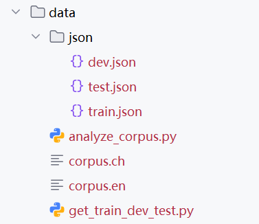
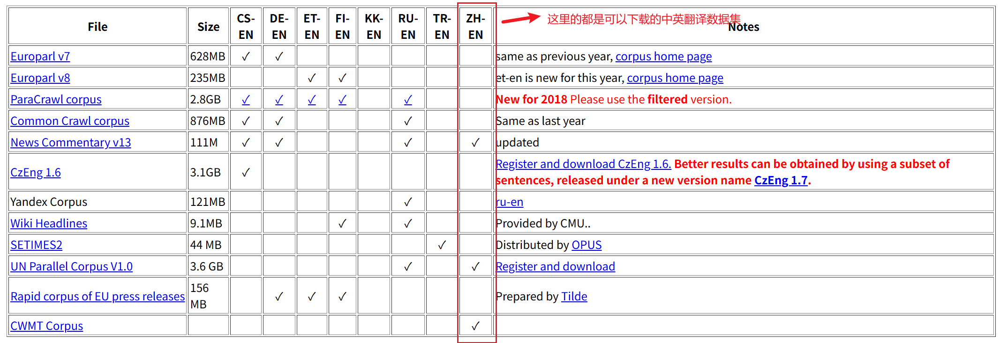
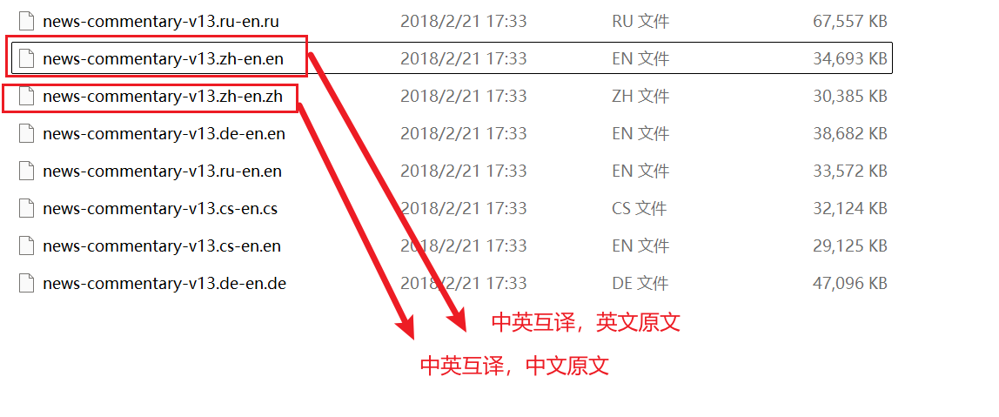
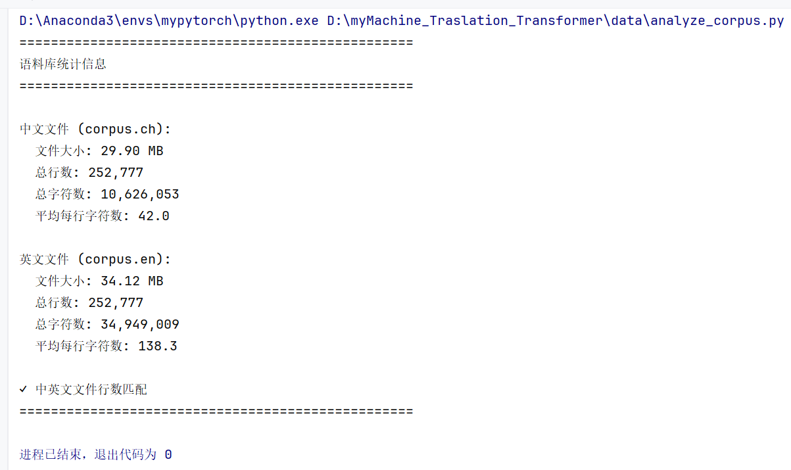
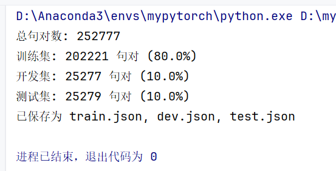
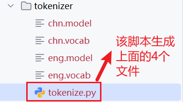

# 基于Transformer的机器翻译
原理部分的笔记请移步：https://github.com/hide-self/myTransformer_learning


## 数据集文件说明


整体的数据集文件放在了`./data`下。




**1.corpus.ch、corpus.en**

数据集原文说明：

corpus.ch、corpus.en两个文件就是翻译前后的完整原文，一句话一行，两个文件每一行一一对应

数据集下载方式：

可以通过这个网址下载类似的数据集：https://www.statmt.org/wmt18/translation-task.html

往下翻到一个表格，我们找到支持 **zh-en** 的数据集，把网址复制出去下载



下载之后进行解压，我们就可以找到对应的文件，`.en`、 `.zh`结尾的文件是可以用记事本打开的文本文件，他们就是英文、中文的翻译原文。



下载后最好改名，方便后续脚本操作


**2.analyze_corpus.py**

脚本作用：用于检测两个翻译原文文件，是否存在，是否行数匹配

脚本源码：

```python
import os


def analyze_corpus(ch_path, en_path):
    """
    分析双语语料库文件的详细信息
    Args:
        ch_path: 中文文件路径
        en_path: 英文文件路径
    """
    # 检查文件是否存在
    if not os.path.exists(ch_path):
        print(f"中文文件不存在: {ch_path}")
        return
    if not os.path.exists(en_path):
        print(f"英文文件不存在: {en_path}")
        return

    # 获取文件大小
    ch_size = os.path.getsize(ch_path)
    en_size = os.path.getsize(en_path)

    # 读取文件内容并统计行数
    with open(ch_path, 'r', encoding='utf-8') as f:
        ch_lines = f.readlines()
    with open(en_path, 'r', encoding='utf-8') as f:
        en_lines = f.readlines()

    # 计算字符数（不包括换行符）
    ch_chars = sum(len(line.strip()) for line in ch_lines)
    en_chars = sum(len(line.strip()) for line in en_lines)

    # 打印统计信息
    print("=" * 50)
    print("语料库统计信息")
    print("=" * 50)
    print(f"\n中文文件 ({ch_path}):")
    print(f"  文件大小: {ch_size / 1024 / 1024:.2f} MB")
    print(f"  总行数: {len(ch_lines):,}")
    print(f"  总字符数: {ch_chars:,}")
    print(f"  平均每行字符数: {ch_chars / len(ch_lines):.1f}")

    print(f"\n英文文件 ({en_path}):")
    print(f"  文件大小: {en_size / 1024 / 1024:.2f} MB")
    print(f"  总行数: {len(en_lines):,}")
    print(f"  总字符数: {en_chars:,}")
    print(f"  平均每行字符数: {en_chars / len(en_lines):.1f}")

    # 验证中英文行数是否匹配
    if len(ch_lines) == len(en_lines):
        print("\n✓ 中英文文件行数匹配")
    else:
        print("\n✗ 警告：中英文文件行数不匹配！")

    print("=" * 50)


if __name__ == "__main__":
    ch_path = 'corpus.ch'
    en_path = 'corpus.en'
    analyze_corpus(ch_path, en_path)

```


输出效果：




**3.get_train_dev_test.py**

脚本作用：将corpus.ch、corpus.en原文每行一一对应地放入json文件中，并划分出训练集`train.json`、开发集`dev.json`、验证集`test.json`

脚本原文：

```python
import json
import random

def split_corpus(zh_file, en_file, train_ratio=0.8, dev_ratio=0.1, test_ratio=0.1, shuffle=True, seed=42):
    """
    将对齐的中英文语料文件分割成 train/dev/test 并保存为 JSON 格式。

    参数:
        zh_file: 中文文件路径，每行一个句子
        en_file: 英文文件路径，每行一个句子
        train_ratio: 训练集比例
        dev_ratio: 开发集比例
        test_ratio: 测试集比例（需满足三者之和为1）
        shuffle: 是否随机打乱数据
        seed: 随机种子，用于复现
    """
    # 检查比例之和是否为1
    assert abs(train_ratio + dev_ratio + test_ratio - 1.0) < 1e-9, "比例之和必须为1"

    # 读取中文和英文文件，去除行尾换行符
    with open(zh_file, 'r', encoding='utf-8') as f:
        zh_lines = [line.strip() for line in f]
    with open(en_file, 'r', encoding='utf-8') as f:
        en_lines = [line.strip() for line in f]

    # 检查行数是否一致
    assert len(zh_lines) == len(en_lines), f"中英文文件行数不一致：{len(zh_lines)} vs {len(en_lines)}"

    # 组成句对列表
    pairs = [[en, zh] for en, zh in zip(en_lines, zh_lines)]

    # 随机打乱
    if shuffle:
        random.seed(seed)
        random.shuffle(pairs)

    # 计算分割点
    total = len(pairs)
    train_end = int(total * train_ratio)
    dev_end = train_end + int(total * dev_ratio)

    train_pairs = pairs[:train_end]
    dev_pairs = pairs[train_end:dev_end]
    test_pairs = pairs[dev_end:]

    # 写入 JSON 文件
    with open('./json/train.json', 'w', encoding='utf-8') as f:
        json.dump(train_pairs, f, ensure_ascii=False, indent=2)
    with open('./json/dev.json', 'w', encoding='utf-8') as f:
        json.dump(dev_pairs, f, ensure_ascii=False, indent=2)
    with open('./json/test.json', 'w', encoding='utf-8') as f:
        json.dump(test_pairs, f, ensure_ascii=False, indent=2)

    # 打印统计信息
    print(f"总句对数: {total}")
    print(f"训练集: {len(train_pairs)} 句对 ({len(train_pairs)/total:.1%})")
    print(f"开发集: {len(dev_pairs)} 句对 ({len(dev_pairs)/total:.1%})")
    print(f"测试集: {len(test_pairs)} 句对 ({len(test_pairs)/total:.1%})")
    print("已保存为 train.json, dev.json, test.json")

if __name__ == "__main__":
    # 使用示例：假设语料文件名为 corpus.zh 和 corpus.en
    split_corpus('corpus.ch', 'corpus.en', train_ratio=0.8, dev_ratio=0.1, test_ratio=0.1)
```

输出：



划分效果`以./json/train.json`为例子


**4.`./json`**

`./json`下面存放着经过脚本**get_train_dev_test.py**，划分好的训练集、开发集、测试集


## 词表的构建与介绍




脚本tokenize.py

```python
# 导入 SentencePiece 库：用于无监督训练子词（BPE/Unigram）模型以及后续编码/解码
import sentencepiece as spm


def train(input_file, vocab_size, model_name, model_type, character_coverage):
    """
    重要说明（官方参数文档可查）：
    https://github.com/google/sentencepiece/blob/master/doc/options.md

    参数含义：
    - input_file: 原始语料文件路径（每行一句，SentencePiece 会做 Unicode NFKC 规范化）
                  支持多文件逗号拼接：'a.txt,b.txt'
    - vocab_size: 词表大小，如 8000 / 16000 / 32000
    - model_name: 模型前缀名，最终会生成 <model_name>.model 和 <model_name>.vocab
    - model_type: 模型类型：unigram（默认）/ bpe / char / word
                  注意：若使用 word，需要你在外部先分好词（预分词）
    - character_coverage: 覆盖的字符比例
        * 中文/日文等字符集丰富语言建议 0.9995
        * 英文等字符集小的语言建议 1.0
    """
    # 这里使用“字符串命令”式的调用来指定训练参数
    # 固定 4 个特殊符号的 id：<pad>=0, <unk>=1, <bos>=2, <eos>=3
    # 这与下游 Transformer 常用配置一致，便于对齐
    input_argument = (
        '--input=%s '
        '--model_prefix=%s '
        '--vocab_size=%s '
        '--model_type=%s '
        '--character_coverage=%s '
        '--pad_id=0 --unk_id=1 --bos_id=2 --eos_id=3 '
    )

    # 将传入参数填充到命令字符串
    cmd = input_argument % (input_file, model_name, vocab_size, model_type, character_coverage)

    # 开始训练；会在当前工作目录下生成 <model_name>.model / <model_name>.vocab
    spm.SentencePieceTrainer.Train(cmd)


def run():
    # ===== 英文分词器配置 =====
    en_input = '../data/corpus.en'      # 英文语料：一行一句
    en_vocab_size = 32000               # 词表大小：翻译任务常见为 16k/32k
    en_model_name = 'eng'               # 输出前缀：会生成 eng.model / eng.vocab
    en_model_type = 'bpe'               # 使用 BPE（也可尝试 unigram）
    en_character_coverage = 1.0         # 英文字符集小 → 用 1.0

    train(en_input, en_vocab_size, en_model_name, en_model_type, en_character_coverage)

    # ===== 中文分词器配置 =====
    ch_input = '../data/corpus.ch'      # 中文语料：一行一句（无需预分词）
    ch_vocab_size = 32000
    ch_model_name = 'chn'
    ch_model_type = 'bpe'
    ch_character_coverage = 0.9995      # 中文推荐 0.9995，极少数冷僻字会映射为 <unk>

    train(ch_input, ch_vocab_size, ch_model_name, ch_model_type, ch_character_coverage)


def test():
    # 加载并调用已训练好的模型进行编码/解码的示例
    sp = spm.SentencePieceProcessor()
    text = "美国总统特朗普今日抵达夏威夷。"

    # 加载中文模型（确保 chn.model 位于当前工作目录）
    sp.Load("./chn.model")

    # 编码为子词片段（字符串），如 ['▁美国', '总统', ...]
    print(sp.EncodeAsPieces(text))

    # 编码为 id（整数序列）
    print(sp.EncodeAsIds(text))

    # 示例：给定一串 id，解码回文本
    a = [12907, 277, 7419, 7318, 18384, 28724]
    # 注意：Python API 的方法名是 CamelCase：DecodeIds / DecodePieces
    print(sp.DecodeIds(a))


if __name__ == "__main__":
    run()
    # test()   # 训练完后，取消注释以做一次快速功能验证

```


运行后，生成`.model`、`.vocab`两种文件

`.vocab`：是人可读清单，负数绝对值越小，它就越常见。（后续不用）

`.model`：一个二进制模型，包含如何把字符串切成子词、如何把子词变回文本，以及所有规则与 ID 映射。用于构建独热向量（后续常用）


## 词嵌入层与位置编码层

创建`./model`文件夹，在这之下，创建`tf_model.py`用于定义Transformer的整体模型代码


**词嵌入层**

vcoab就是词表维度数(见原理部分的v)，d_model就是降维后词嵌入向量维度(见原理部分的d)

```python
# 词嵌入层
class Embeddings(nn.Module):
    def __init__(self,d_model,vocab):
        """
        词嵌入层初始化
        (输入的是一个v*1的矩阵，则词嵌入层就是一个d*v矩阵，输出为d*1矩阵，此时已经被有效降维)
        :param d_model:相当于d最终输出的维度数
        :param vocab:相当于v为词表大小，即独热向量维度数
        """
        super(Embeddings,self).__init__()
        # Embedding层，将v*1的独热编码向量，映射成d*1的词向量
        self.lut=nn.Embedding(vocab,d_model)
        # 存储输出词向量的维度数d
        self.d_model=d_model

    # 前向传播
    def forwrad(self,x):
        # 乘以sqrt(d)是Transformer原文的做法
        # 目的：使得嵌入向量的量级与后续残差/位置编码在同一大小尺度，稳定训练、加快收敛
        return self.lut(x)*math.sqrt(self.d_model)
```


**位置编码层**

```python
# 位置编码层(公式见原理部分)
class PositionalEncoding(nn.Module):
    def __init__(self,d_model,dropout,max_len=5000,device=DEVICE):
        super(PositionalEncoding,self).__init__()
        self.dropout=nn.Dropout(p=dropout)  # 随机失活

        # 初始化一个大小为 L*d 的全0矩阵(形状与词嵌入矩阵相同)
        pe=torch.zeros(max_len,d_model,device=device)
        # 生成一个位置下标的tensor矩阵(每一行都是一个位置下标)
        position = torch.arange(0., max_len, device=DEVICE).unsqueeze(1)
        # 这里幂运算太多，我们使用exp和log来转换实现公式中pos下面要除以的分母（由于是分母，要注意带负号）
        div_term = torch.exp(torch.arange(0., d_model, 2, device=DEVICE) * -(math.log(10000.0) / d_model))

        # 位置编码奇偶位计算
        pe[:,0::2]=torch.sin(position*div_term)
        pe[:,0::2]=torch.cos(position*div_term)

        # 在最前面开始加1个维度，变成 1*L*d大小的矩阵(代码中相当于1*max_len*d_model大小的矩阵)
        # (这样做方便后续与一个batch的句子所有词的embedding批量相加)
        pe=pe.unsqueeze(0)
        # 将pe矩阵以持久的buffer状态存下(不会作为要训练的参数)
        self.register_buffer('pe', pe)

    def forward(self,x):    # 输入的数据x就是词嵌入向量
        # 将一个batch的句子所有词的embedding与已构建好的positional embeding相加
        # (这里按照该批次数据的最大句子长度来取对应需要的那些positional embedding值)
        x = x + Variable(self.pe[:, :x.size(1)], requires_grad=False)
        return self.dropout(x)  # 随机失活
```


**配置文件初步书写**

创建`./config.py`这个里面存放着整个项目的可变配置部分内容，现在先存放部分配置信息，后面继续补全

```python
import torch

"""
模型参数配置
"""
d_model=512 #相当于词嵌入矩阵的d，用于降维
dropout=0.1 #随机失活10%


"""
词表的配置
"""
# 源语言(英语)的词表大小
src_vocab_size=32000
# 目标语言(中文)的词表大小
tgt_vocab_size=32000


"""
训练配置
"""
# 一个批次的大小
batch_size=32
# 训练的总轮次
epoch_num=3
# 学习率
lr=3e-4

"""
解码和生成设置
这些参数控制模型生成输出时的行为，影响生成的句子质量。
"""


"""
文件路径和模型配置
这些参数用于定义文件路径和是否加载预训练模型的设置。
"""
data_dir = './data'
train_data_path = './data/json/train.json'
dev_data_path = './data/json/dev.json'
test_data_path = './data/json/test.json'

model_path = './weights/transformer_model.pth'
test_model_path = './run/train/exp/weights/best_bleu_26.30.pth'


"""
设备配置
这些参数用于配置模型运行的硬件设备。
"""
# 指定使用的GPU设备的ID。
# 指定设备ID的列表。
gpu_id = '0'
device_id = [0]
# set device
if gpu_id != '':
    device = torch.device(f"cuda:{gpu_id}")
else:
    device = torch.device('cpu')
```


## 注意力机制

依旧定义到`./model/tf_model.py`中


定义attention函数

**传入：**

Q、K、V三个矩阵

mask掩码矩阵，掩码矩阵为0的部分，到时候会填充为负无穷

dropout随机失活函数

**输出：**

注意力机制矩阵、注意力机制得分矩阵


```python
# 注意力机制
def attention(query,key,value,mask=None,dropout=None):
    """
    注意力机制
    :param query:Q矩阵，形状L*d_k
    :param key: K矩阵，形状L*d_k
    :param value:V矩阵，形状L*d_k
    :param mask:掩码矩阵，哪些部分为0，到时候scores就填充负无穷
    :param dropout:随机失活函数
    :return:
    """
    d_k=query.size(-1)

    # Q与K^T做矩阵相乘，然后除以根号下d_k
    scores=torch.matmul(query,key.transpose(-2,-1))/math.sqrt(d_k)
    # tensor.transpose(dim1.dim2)表示将dim1与dim2两个维度交换

    if mask is not None:    # mask不是None
        scores.masked_fill(mask==0,1e-9)    # mask为0的元素位置，在scores中填充为负无穷

    # softmax函数，获得注意力机制得分矩阵
    # softmax按照列维度来进行处理
    # 这样就表示，以当前行作为查询，同一行中所有列作为索引，同一行中所有列的值加起来为1
    p_attn=F.softmax(scores,dim=-1)

    # dropout随机失活函数
    if dropout is not None:
        p_attn=dropout(p_attn)

    # 输出：注意力机制矩阵、注意力机制得分矩阵
    return torch.matmul(p_attn,value),p_attn
```


## 多头注意力机制

定义到`./model/tf_model.py`中

```python
# 深拷贝N个模块
def clones(module, N):
    """克隆模型块，克隆的模型块参数不共享"""
    return nn.ModuleList([copy.deepcopy(module) for _ in range(N)])

# 多头注意力机制
class MutiHeadedAttention(nn.Module):
    def __init__(self,h,d_model,dropout=0.1):
        """
        初始化多头注意力机制类
        :param h: h表示头数
        :param d_model: 词嵌入矩阵L*d中的d
        :param dropout: 随机失活概率
        """
        # 保证可以整除
        assert d_model%h==0
        # 通过d_model、h获得d_k，这样获得的d_k便于计算
        self.d_k=d_model//h
        #head数量
        self.h=h
        #4个全连接函数，供应 WQ、WK、WV矩阵和最后h个多头注意力矩阵concat之后进行变换的矩阵W_o
        self.linears=clones(nn.Linear(d_model,d_model),4)
        self.attn=None
        self.dropout=nn.Dropout(p=dropout)

    def forward(self,query,key,value,mask=None):
        if mask is not None:
            mask=mask.unsqueeze(1)
        # query的第一个维度值为batch size
        nbatches=query.size(0)
        # 将embedding层乘以WQ，WK，WV矩阵(均为全连接)
        # 并将结果拆成h块，然后将第二个和第三个维度值互换(具体过程见上述解析)
        # 最后query、key、value，就是含有h个元素的列表，他们就是h
        query, key, value = [l(x).view(nbatches, -1, self.h, self.d_k).transpose(1, 2)
                             for l, x in zip(self.linears, (query, key, value))]
        #调用attention函数
        x,self.attn=attention(query,key, value, mask,self.dropout)
        # 将h个多头注意力矩阵concat起来（注意要先把h变回到第三维的位置）
        x = x.transpose(1, 2).contiguous().view(nbatches, -1, self.h * self.d_k)
        # 使用self.linears中构造的最后一个全连接函数来存放变换后的矩阵进行返回
        return self.linears[-1](x)
```


